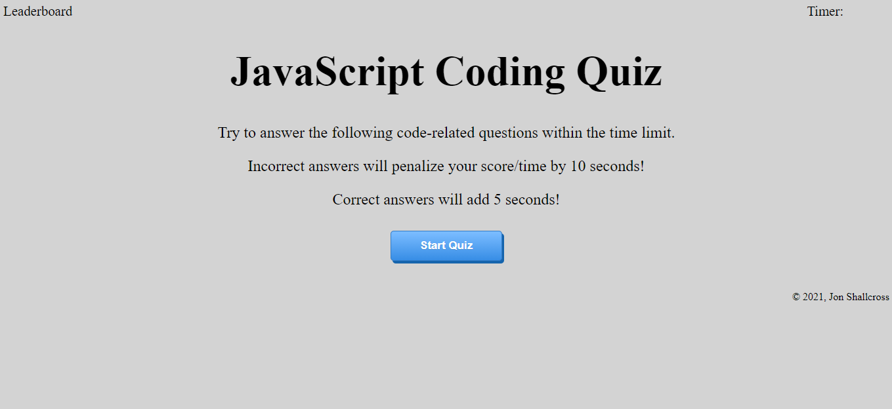

# JavaScript-Code-Quiz
A quiz on JavaScript in which the user is asked a series of multiple choice questions. When the user starts the quiz a timer is started. The user is given a 10 second penalty for incorrect answers and awarded an extra 5 seconds for correct answers. Upon completion of the questions or the timer ends, the user is asked for their initials to add to the leaderboard. Local storage is used to keep the previous scores on the leaderboard.

## Live Website
https://jshallcross.github.io/JavaScript-Code-Quiz/
## Technologies Used
HTML / CSS / JAVASCRIPT 

## Screenshot

